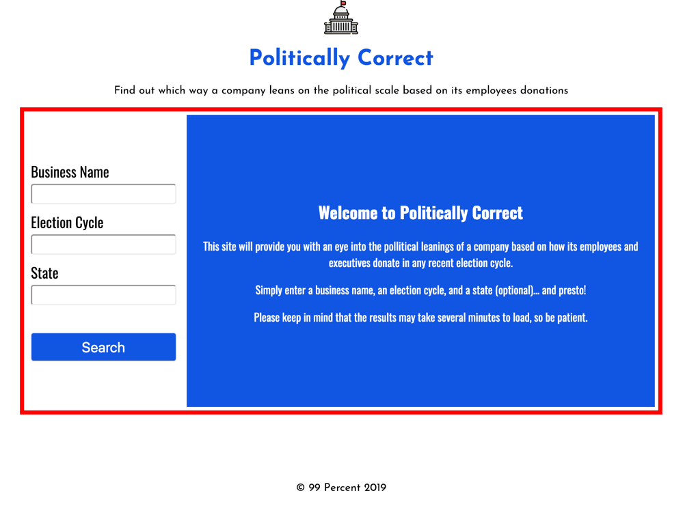
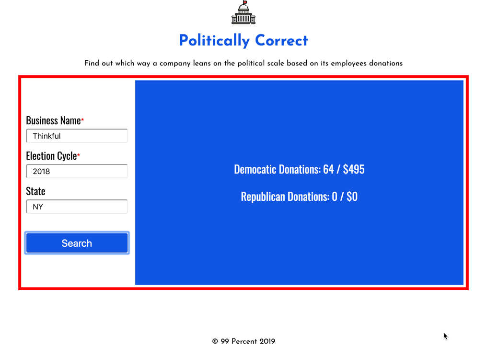

<!-- # Politically Correct App

Initial wireframes:

https://photos.app.goo.gl/rq769bEXj6VRuNV18 -->

# Politically Correct

An app that allows you to see which way an US-based company leans on the political scale based on the political donations of its employees and executives.

## Motivation

We wanted to provide a tool that would help shed light on relevant political information that might otherwise be difficult to source. 

## Screenshots
Landing Page:

Results Page:

## Built With

### Front-End
* HTML
* CSS
* Javascript
* Jquery

## Features

* Select a Company
* Select an Election Cycle
* Indicate a State
* See breakdown of Democratic and Republican donations by volume and by the total dollar amount

## Demo

- [Live Demo](https://matrayu.github.io/Politically_Correct/)

## Authors

* **Matthew Friedberg** - ** - Front-End development/testing, styling

## Acknowledgments

* **TJ Stalcup** - ** - Mentor Extrodinare